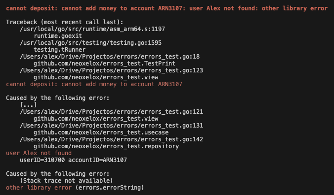
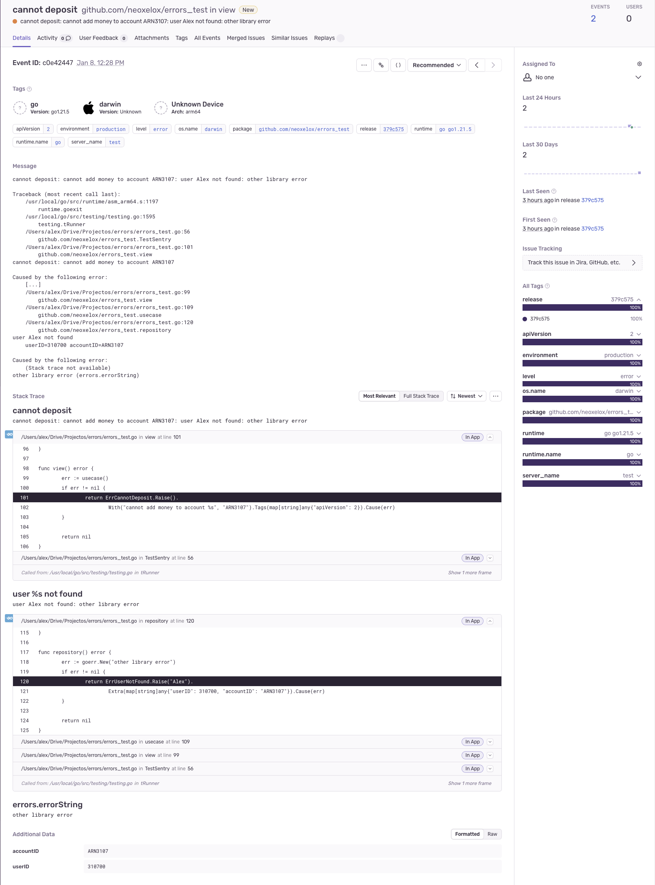

# errors   

**`Highly opinionated Go errors package.`**

## Console Output

## Sentry Output

## New Relic Output

TODO

## Install

`go get github.com/neoxelox/errors`

## Usage

Check and run the example test file [errors_test](errors_test.go): `go test -v --run TestPrint`.

See [`GoDev`](https://pkg.go.dev/github.com/neoxelox/errors) for further documentation.

## Contribute

Feel free to contribute to this project : ) .

## License

This project is licensed under the [MIT License](https://opensource.org/licenses/MIT) - read the [LICENSE](LICENSE) file for details.
